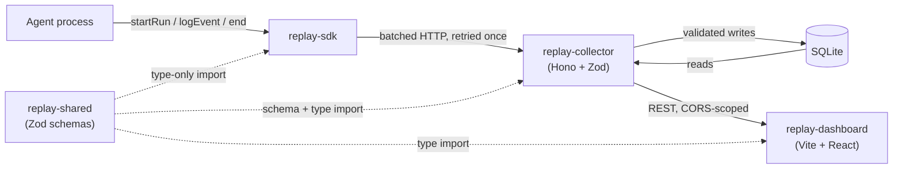

# Replay

Flight recorder for AI agents. Record every tool call, retry, and cost, then
replay the run on a timeline like game footage.

Debugging an agent today means reading console logs and guessing why it looped,
burned three dollars in tokens, or silently failed a tool call. Replay records
the run as an append-only event log and gives you a scrubber to step through it.

**Status: recording and replay both work end to end.** The SDK, collector,
and storage layer are implemented and tested against a running instance, not
just mocks. The dashboard lists runs and renders a run on a hand-built
timeline with a working scrubber (drag, keyboard step, adjustable-speed
playback), an event inspector, and a cost breakdown.

## Demo

A recorded walkthrough of the scrubber will be added here.

## Quickstart

```ts
import { Replay } from "replay-sdk";

const replay = new Replay({ endpoint: "http://localhost:4747" });
const run = replay.startRun({ name: "my-agent", model: "gpt-4o-mini" });

run.logEvent({ type: "tool_call", payload: { toolName: "search", args: { q: "..." } } });
// ...the rest of your agent's existing logic...

await run.end({ status: "completed" });
```

`replay-sdk` isn't published to npm yet - for now it's consumed as a pnpm
workspace package (see Setup below). The SDK never throws into your agent:
if the collector is unreachable, your agent runs exactly as it would without
this library.

## Architecture



Full system design and the reasoning behind these decisions:
[`docs/ARCHITECTURE.md`](docs/ARCHITECTURE.md). Data contract:
[`docs/EVENT_SCHEMA.md`](docs/EVENT_SCHEMA.md).

## Layout

Monorepo, pnpm workspaces.

| Package | What it is |
|---|---|
| `shared/` | `replay-shared` - Zod event schemas, the wire contract. Not published |
| `sdk/` | `replay-sdk` - drop-in instrumentation, zero runtime dependencies |
| `collector/` | `replay-collector` - Hono + Zod API over SQLite |
| `dashboard/` | `replay-dashboard` - Vite + React timeline scrubber |

## Design notes

- **Append-only event log.** Events are facts. Run-level totals are derived by
  summing events, never mutated independently.
- **`(run_id, seq)` orders events, not timestamps.** Clocks are unreliable and
  batches can arrive out of order after a retry. A unique index on that pair
  makes re-sending a batch idempotent, which is what lets the SDK retry without
  any coordination.
- **The SDK never crashes the host agent.** Your agent runs identically whether
  the collector is up, down, or returning garbage.
- **The SDK has zero runtime dependencies.** It shares schema types with the rest
  of the repo through type-only imports, which the compiler erases.
- **The timeline is hand-built.** No charting library.
- **New dependency versions are held back for 7 days before install** (pnpm's
  `minimumReleaseAge`), and native postinstall scripts are blocked by default
  except for an explicit, reviewed allowlist. Most recent npm supply-chain
  incidents were caught and pulled within that window.

## Setup

Node >= 20, pnpm.

```
pnpm install
pnpm --filter replay-shared build   # sdk and collector consume its dist output
pnpm typecheck                      # all workspaces
pnpm dev:collector                  # collector on :4747
pnpm dev:dashboard                  # dashboard on :5173
```

`better-sqlite3` is a native module. It normally installs a prebuilt binary; if
none matches your platform it compiles with node-gyp, which on Windows needs
Visual Studio Build Tools.

## Limitations

- SQLite only, local-first. No hosted or multi-user mode.
- No auth. Run the collector on localhost.
- Payloads over 50KB are truncated by the SDK before they are sent.
- The events endpoint is cursor-paginated at 500 per page; the dashboard
  fetches only the first page, so a run longer than that is only partially
  visible on the timeline today.
- The timeline renders one SVG element per event and hasn't been load-tested
  at large event counts. Canvas-based rendering is the planned path if that
  turns out to matter.
- TypeScript only.
