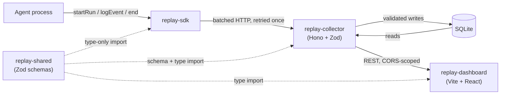

# Architecture

This document describes how Replay is put together: the components, the data
model, and the reasoning behind the decisions that would otherwise need to be
reverse-engineered from the code. The event schema and API contract are
authoritative in [`EVENT_SCHEMA.md`](EVENT_SCHEMA.md); this document is the
system-level view that sits above it.

## Overview

Replay instruments an AI agent's run, sends what happened to a local
collector, and replays it on a timeline. Three moving pieces:

1. **`replay-sdk`** - a library the agent process imports. Starts a run,
   records events (tool calls, model calls, retries, errors) as they happen,
   and sends them to the collector in the background.
2. **`replay-collector`** - an HTTP API that validates incoming events and
   persists them to SQLite.
3. **`replay-dashboard`** - a web UI that reads runs back from the collector
   and renders them.

A fourth package, **`replay-shared`**, holds no runtime behavior of its own.
It is the Zod schema definitions that define the wire format all three other
packages agree on.

## System diagram

The SDK and the dashboard both talk to the collector, but as different kinds
of client: the SDK runs inside the agent's Node process and calls the
collector directly (no browser, so no CORS boundary). The dashboard runs in a
browser on a different origin, so the collector enables CORS specifically for
the dashboard's origin. Same API, two different trust boundaries.

## Components

### `replay-shared`

Zod schemas for every event type, plus the request/response shapes for the
collector's API. This is the single source of truth for what a valid event or
API call looks like - nothing downstream re-derives or re-guesses a shape.

Two kinds of exports live here, deliberately different:

- **Zod schemas** (`EventSchema`, `CreateRunRequestSchema`, ...) for shapes
  that need runtime validation of untrusted input - used by the collector at
  the edge.
- **Plain TypeScript interfaces** (`RunSummary`, `EventRecord`) for response
  shapes the collector constructs itself from already-validated data. There is
  nothing to validate on the way out, only a shape to keep from silently
  drifting between what the collector sends and what the dashboard expects.

### `replay-sdk`

The library an agent process imports. Its single hard constraint: it must
never be the reason an agent crashes, hangs, or behaves differently, whether
the collector is reachable or not. Every network call and serialization step
is wrapped so a failure is swallowed and optionally surfaced through a
caller-supplied error callback, never thrown.

It has zero runtime dependencies. It shares event and API shapes with the
rest of the system by importing types only (`import type`) from
`replay-shared` - TypeScript erases type-only imports at compile time, so the
compiled SDK carries no trace of Zod or any other dependency. An automated
check in the test suite verifies this holds, both in the source and in the
compiled output, rather than relying on it staying true by convention.

Events are buffered locally in a fixed-capacity ring buffer (oldest dropped
first if the buffer fills, with a count kept of how many were dropped) and
sent in batches on an interval and when the run ends, with one retry per
request before giving up on that batch silently.

### `replay-collector`

An HTTP API (Hono) in front of SQLite (better-sqlite3). Validates every
request body and query parameter with the shared Zod schemas at the edge;
nothing downstream re-validates. Storage uses plain SQL migrations tracked in
a small internal table, run in order at startup - no ORM, no migration
framework.

Two properties of the storage layer are worth calling out because they are
not obvious from reading a single endpoint in isolation:

- **The event log is append-only.** Nothing ever updates a stored event.
  Run-level totals (tokens, cost) are recomputed by summing the event log
  inside the same transaction as an insert, not incremented from the incoming
  batch - incrementing would double-count if a batch were ever retried.
- **Retries are idempotent by construction.** A unique index on
  `(run_id, seq)` means re-sending the same batch after a timeout is a no-op,
  not a duplicate. This is what lets the SDK retry without any coordination
  with the collector.

### `replay-dashboard`

A Vite + React app that reads from the collector's API and renders a
timeline. Routing is a small hand-rolled History API wrapper - the
application only has two routes, which doesn't justify a routing library.
The timeline itself is hand-built SVG rather than a charting library, since
rendering and eventually scrubbing through time-series events is the part of
this project worth owning rather than importing.

## Data model

**`runs`** - one row per recorded run: identity (`id`, `name`, `agent_name`,
`model`), lifecycle (`started_at`, `ended_at`, `status`), and totals
(`total_tokens_in`, `total_tokens_out`, `total_cost_usd`) derived from that
run's events.

**`events`** - one row per recorded event, ordered and deduplicated by
`(run_id, seq)`. `seq` is a monotonic counter assigned by the SDK, starting
at 0 for every run. It is the ordering and deduplication authority, not the
event's timestamp - clocks are unreliable and a retried batch can arrive out
of order, but `seq` is assigned once, locally, before anything is sent.

Nine event types cover a run: `run_start`, `llm_call`, `llm_response`,
`tool_call`, `tool_result`, `retry`, `error`, `agent_decision`, `run_end`.
The set is intentionally closed - a new type is a schema change, not a
one-line addition, which is what keeps every consumer of the event log (the
collector, the dashboard, anything reading the schema) able to reason about
the full space of what an event can be.

Every event shares a strictly-validated envelope (`seq`, `type`, `timestamp`,
optional `durationMs`/`tokensIn`/`tokensOut`/`costUsd`) around a payload that
is validated loosely on purpose: every documented payload field is optional,
and unrecognized fields are kept rather than rejected. Agent frameworks shape
their tool calls and model responses differently enough that a strict payload
schema would break on real-world data at exactly the moment someone is trying
to debug something. The envelope is where correctness is enforced; the
payload is where flexibility is.

Payloads larger than 50KB are truncated by the SDK before they are ever sent,
replaced with a marker carrying the original size and a preview - protecting
the collector's disk and the network, not something enforced after the fact.

### Rendering events on a timeline

Two of the nine event types are meant to be read as pairs rather than single
points in time: a `tool_call` and its `tool_result` (matched by a shared call
identifier in the payload), and an `llm_call` immediately followed by its
`llm_response`. The dashboard uses this pairing to draw a span between the
two events rather than a point for each. An event that never finds its pair -
a `tool_call` with no matching `tool_result` - stays a point, which is itself
a signal: visually, it looks like what it is, a call that never returned.

## API surface

| Method | Path | Purpose |
|---|---|---|
| `POST` | `/runs` | Create a run |
| `POST` | `/runs/:id/events` | Append a batch of events (idempotent) |
| `PATCH` | `/runs/:id` | Update a run's final status |
| `GET` | `/runs` | List runs, paginated, newest first |
| `GET` | `/runs/:id` | Get one run and its derived totals |
| `GET` | `/runs/:id/events` | Get a run's events, cursor-paginated by `seq` |

Every error the caller can cause returns `400` (invalid input, with the
validation issues attached), `404` (unknown run), or `413` (an oversized
batch) - never a `500`. The full request/response shapes, including exact
field names and validation rules, are documented in
[`EVENT_SCHEMA.md`](EVENT_SCHEMA.md).

## Testing and verification

Each package's non-trivial logic has unit tests (`node:test`, run directly
against TypeScript source via `tsx`, no separate test framework). Alongside
those, a small suite of architectural checks runs as part of the same test
command and fails the build if a stated invariant is violated - the SDK
picking up a runtime dependency, an `UPDATE` appearing against the events
table, a charting library appearing in the dashboard's dependencies. The
point of encoding these as tests rather than only as documentation is that a
rule written in prose can be missed in review; a failing test cannot.

Where practical, changes are also verified against a running instance of the
system rather than mocks alone: a real collector process backed by a real
SQLite file, driven by the actual SDK, read back through the actual API.
Several bugs were only visible this way - most notably a missing CORS policy
that every mock and every `curl`-based check passed cleanly, because neither
enforces the browser-only restriction that was actually broken.

## Known limitations

- **Local-first, no auth.** The collector is meant to run on `localhost`
  alongside the agent it is recording. There is no authentication layer and
  no multi-user support.
- **SQLite only.** No hosted or multi-tenant storage backend.
- **Large payloads are truncated, not stored in full.** A payload over 50KB
  is replaced with a preview and a size marker before it is sent.
- **The timeline has not been load-tested at large event counts.** It
  currently renders one element per event; a very long-running, high-volume
  run has not been measured for rendering performance. Canvas-based rendering
  is the planned path if that turns out to matter in practice.
